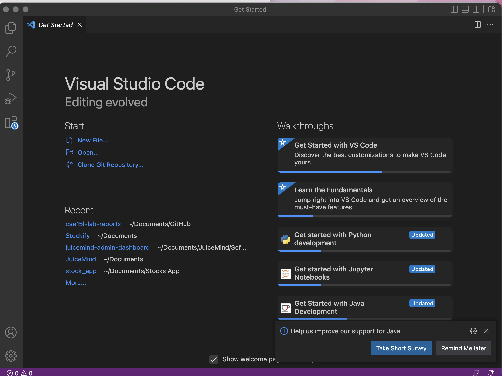
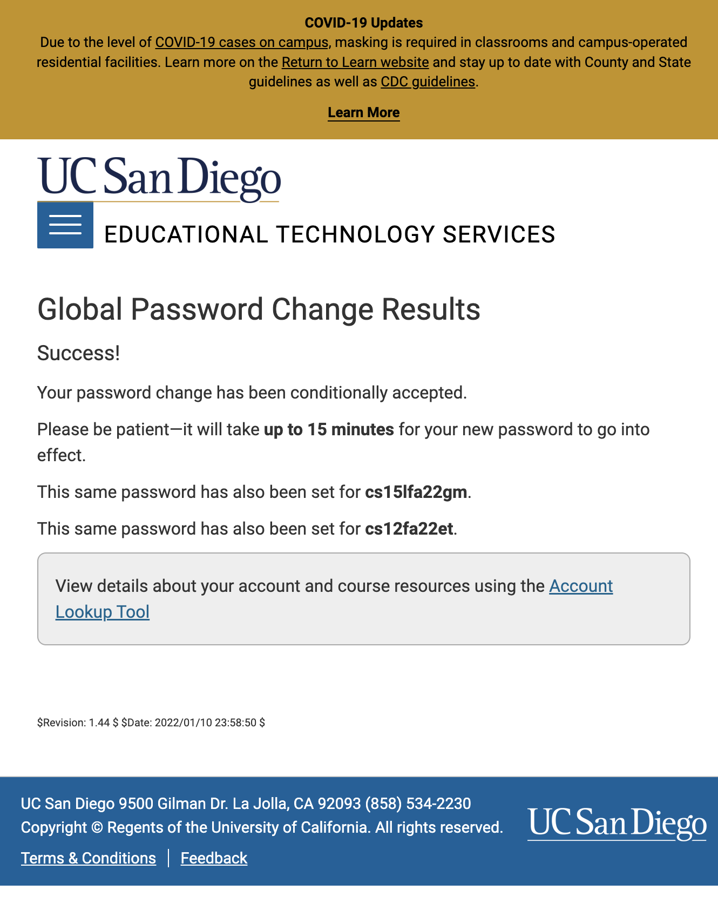
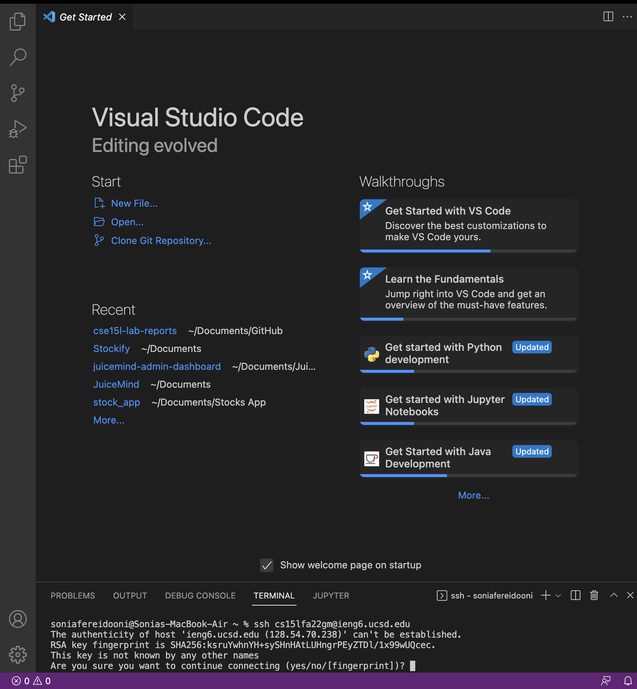
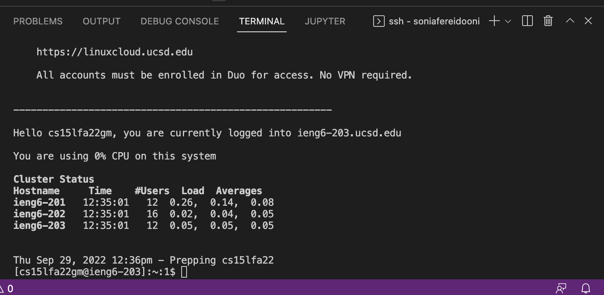
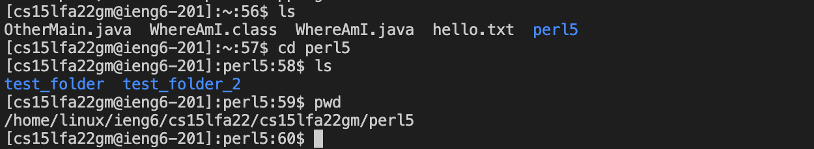
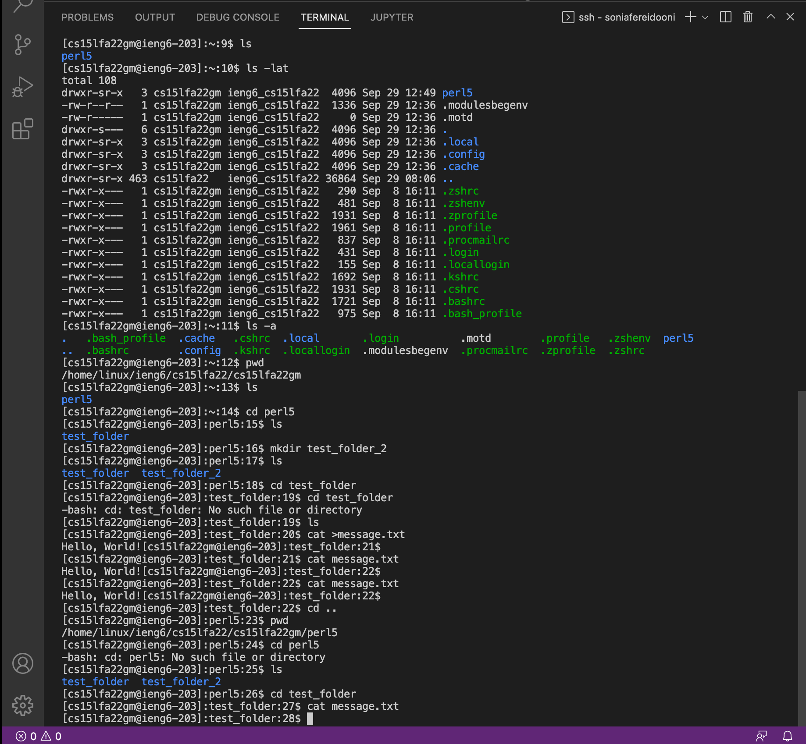
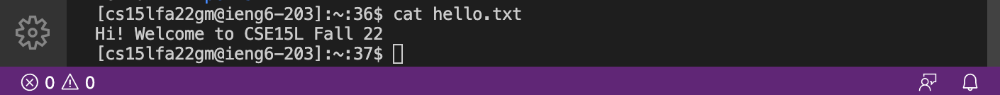
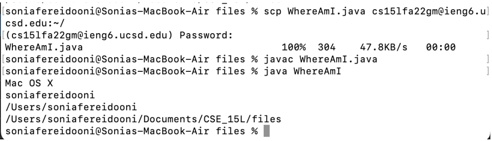
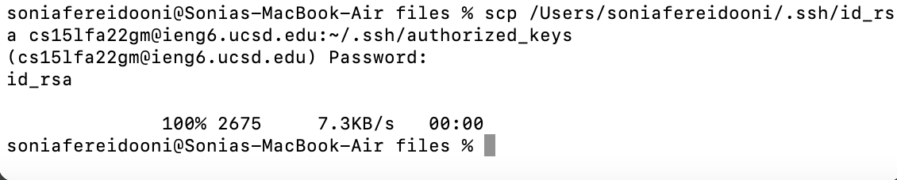
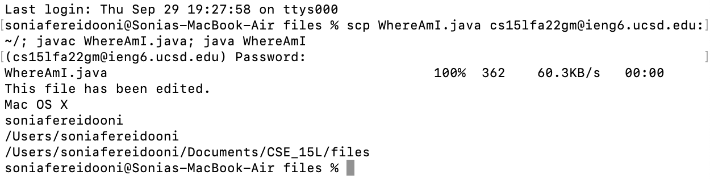

# lab report week 1

## **Introduction**

In this lab we will be learning how to log into a course-specific account on ieng6, learning terminal commends, moving files with scp, and setting an SSH key. This is a great introduction to learning more about using remote servers. 

## **Step 1: Installing VScode**



- To install VS Code, you must first go on https://code.visualstudio.com/download and click on the download for your respective operating system. 
- Go through the installation wizard to set up VS Code on your device
- Once installed, open VS Code and personalize it as wanted

## **Step 2: Remotely Connecting**

- In order to connect remotely, you must first go and set your password for the server on the UCSD site (pictured below)



- Then, go on VS Code, open a new terminal, and enter the following command (takes place on your local device) :
```
# code block

ssh cs15lfa22zz@ieng6.ucsd.edu
```

- You will then be prompted to enter your password. Enter your newly set password and prepare to enter the server! The screen pictured below



- Enter "yes" to authorize connecting to the server, and then enter your password



## **Step 3: Trying Some Commands**

- Now it's time to try out some commands! 

- Here is an example of some basic commands such as "cd" (change directory), "ls" (list directory items), and "pwd" (place within directory). In the image below, you can see that in the remote server I am entering the perl5 directory with cd, listing out all its contents, and then viewing my place in the directory. 



- The next set of commands I ran include ls -lat which shows all the files and directories in a list, and ls -a which lists all the files in the server. 



- Next up we've got a cat command that I used to print out the contents of the hello.txt file. 



## **Step 4: Moving Files with scp**

- Now that we've gotten familiarized with the commands and working with remote servers, we can learn how to securely copy files from your local device to the remote server. 

- To do this, I opened VS Code and created a new file and copied in the code for a Java example class (WhereAmI.java). I tested the compilation and running of the file on my computer by writing in the command:

```
# code block

javac WhereAmI.java
java WhereAmI
```

- Then, I wrote the following code into my local device terminal to securely copy the file over to my remote server.

```
# code block

scp WhereAmI.java cs15lfa22gm@ieng6.ucsd.edu:~/
```

- I was then prompted to enter in my SSH password to log in and copy in my file. 



## **Step 5: Setting an SSH Key**

- SSH is essentially the practice of securely logging into remote servers. But, this practice can be quite tedious when you have to enter your password everytime you want to enter the server and complete certain actions. To avoid this process, SSH keys can be used to make the process a lot easier. 

- SSH keys essentially match up the files between folders to validate access without having to type in passwords. 

- In order to set this up, you have to open the terminal and write in: 

```
# code block

ssh-keygen
```

- I then entered /Users/soniafereidooni/.ssh/id_rsa when prompted for the directory to connect to. 

- You will now enter your password another time and it will return a visual fingerprint key art. 

- Once this is done, you will have to do a final entry into the directory with your user and password credentials with the following commands:

on personal computer:
```
# code block

ssh cs15lfa22gm@ieng6.ucsd.edu
```
local server:
```
# code block

mkdir .ssh
```
on personal computer:
```
# code block

scp /Users/soniafereidooni/.ssh/id_rsa.pub cs15lfa22gm@ieng6.ucsd.edu:~/.ssh/authorized_keys
```



## **Step 6: Optimizing Remote Running**

- Now for the fun part--learning how to code fast and efficiently! Learn a few ways to make terminal commands easier to run:
1. combine commands by writing them on the same command line separated with semi colons. 
2. run the same command as the previous one by clicking the up arrow. This will run the last command. 

- As seen pictured below, you can combine the three commands for the secure file copying and the compilation and running of the WhereAmI file into one line separated by semicolons. 




