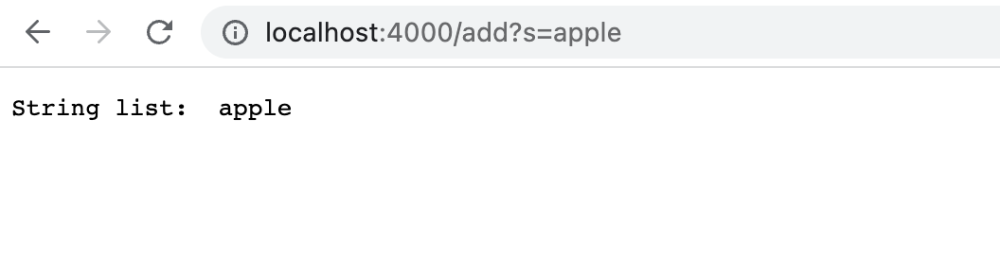
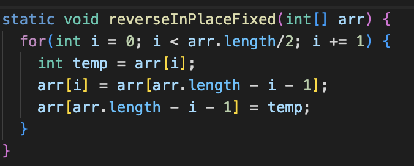
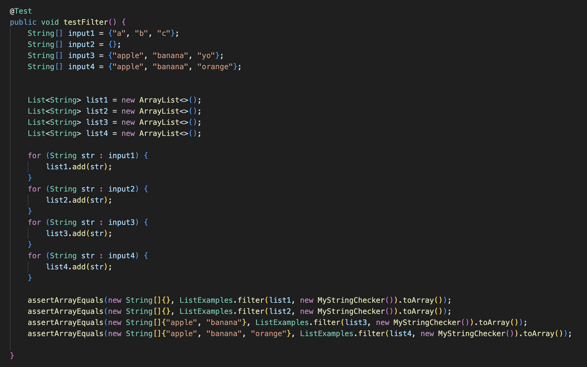

# lab report week 3

## **Introduction**

In this lab we will be learning how to debug code and write specific tests that uncover the symptoms and bugs in the code. Teamwork and analysis are essential parts of this lab as they help move along the bug-finding process. Take some time to understand the definitions of symptoms (how a bug makes itself apparent in the code, incorrect outputs)and bugs (the actual error within the code that caused the faulty output/behavior). 

## **Part 1: Simplest Search Engine**

```
# My Search Engine Code 

import java.io.IOException;
import java.net.URI;
import java.util.*;

class Handler implements URLHandler {
    // The one bit of state on the server: a number that will be manipulated by
    // various requests.
    ArrayList <String> words = new ArrayList<String>();

    public String handleRequest(URI url) {
        if (url.getPath().equals("/")) {
            String printList = "";
            for (int i = 0; i < words.size(); i++) {
                printList += words.get(i) + " ";
            }
            return String.format("String list: %s", printList);
        } 
        else if (url.getPath().contains("/search")) {
            String[] parameters = url.getQuery().split("=");
            if (parameters[0].equals("s")) {
                String printList = " ";
                for (int i = 0; i < words.size(); i++) {
                    if (words.get(i).contains(parameters[1])) {
                        printList += words.get(i);
                    }
                }
                return String.format("Search Results: %s", printList);
            }
            return String.format("have an input");
        } 
        else {
            //System.out.println("Path: " + url.getPath());
            if (url.getPath().contains("/add")) {
                String[] parameters = url.getQuery().split("=");
                if (parameters[0].equals("s")) {
                    words.add(parameters[1]);
                    String printList = "";
                    for (int i = 0; i < words.size(); i++) {
                        printList += words.get(i) + " ";
                    }
                    return String.format("String list: %s", printList);
                }
            }
            return "404 Not Found!";
        }
    }
}

public class SearchEngine {
    public static void main(String[] args) throws IOException {
        if(args.length == 0){
            System.out.println("Missing port number! Try any number between 1024 to 49151");
            return;
        }

        int port = Integer.parseInt(args[0]);

        Server.start(port, new Handler());
    }
}
```
**Questions To Answer**
1. Which methods in your code are called
2. What the values of the relevant arguments to those methods are, and the values of any relevant fields of the class
3. If those values change, how they change by the time the request is done processing

<u>**add to words list**</u>

1. ***Methods called:*** 
<br/>The handleRequest method was called for this to take place. Other methods that were called within the handleRequest method include the getPath method, the getQuery method, add (to ArrayList) method, contains method, and equals method. The handleRequest method is important in dissecting the url and splitting up its path into domain, path, and query in order to determine whether to add or search the list of Strings. 
2. ***Values of relevant arguments?*** 
<br/>The argument to the initial handleRequest url is "localhost:4000/add?s=apple". This url is then dissected by the getPath method and split into sections dictated by the "/". The path is then checked to see whether it contains "/", "/search", or "/add" as an input. Then, based on this, the query is checked with the getQuery method in order to determine what String to add to the list in the case of the "/add" path. The string "apple" is then added to the String list of words. 
3. ***Value changes***
<br/>The values of the relevant arguments to those methods do not change unless the query is changed, in which case the output of the method will be altered. For example, if the add is changed to a search in the url, the method will search for the presence of the inputted string rather than add it to the list. In this case, the add method is not changed, but the argument to the add query is changed later on to "banana" and then to "orange" and finally to "organix", in which case all three strings are sequentially added to the list. 


1. ***Methods called:*** 
<br/>This screenshot mimics the first one, such that the same methods are called: the handleRequest, getPath, getQuery, add (to ArrayList), contains, and equals methods. The handleRequest method is again important in dissecting the url and splitting up its path into domain, path, and query in order to determine whether to add or search the list of Strings. 
2. ***Values of relevant arguments?*** 
<br/>The argument to the initial handleRequest url is "localhost:4000/add?s=orange". This url is then dissected by the getPath method and split into sections dictated by the "/". The path is then checked to see whether it contains "/", "/search", or "/add" as an input. Then, based on this, the query is checked with the getQuery method in order to determine what String to add to the list in the case of the "/add" path. The string "orange" is then added to the String list of words. (Note: prior to this, the String "banana" was added to the list by the query "?s=banana" so the list of Strings consists of apple, banana, and orange at this point in time)
3. ***Value changes***
<br/>The values of the relevant arguments to those methods do not change unless the query is changed, in which case the output of the method will be altered. For example, if the add is changed to a search in the url, the method will search for the presence of the inputted string rather than add it to the list. In this case, the add method is not changed, but the argument to the add query is initially changed from "apple" to "banana" currently to "orange" and finally to "organix", in which case all three strings are sequentially added to the list. 

<u>**search query**</u>

1. ***Methods called:*** 
<br/>The handleRequest method was called for this to take place. Other methods that were called within the handleRequest method include the getPath method, the getQuery method, add (to ArrayList) method, contains method, and equals method. The handleRequest method is important in dissecting the url and splitting up its path into domain, path, and query in order to determine whether to add or search the list of Strings. 
2. ***Values of relevant arguments?*** 
<br/>The argument to the initial handleRequest url is "localhost:4000/search?s=an". This url is then dissected by the getPath method and split into sections dictated by the "/". The path is then checked to see whether it contains "/", "/search", or "/add" as an input. Then, based on this, the query is checked with the getQuery method in order to determine what String to add to the list in the case of the "/search" path. The string "an" is then searched for within the String list of words by iterating through the list values. The strings that contain the "an" argument are then returned to the browser page. 
3. ***Value changes***
<br/>The values of the relevant arguments to those methods do not change unless the query is changed, in which case the output of the method will be altered. In this case, the "add" from the previous url is changed to a "search", the method then searches for the presence of the inputted string rather than adding it to the list. In this case, since "orange" and "organix" both have an "an" they are returned to the browser page. 

## **Part 2: Debugging**

Choose two of the bugs from different files above. For each, show:

### Bug 1: 
* **file**: ArrayExamples.java
* **failure-inducing input:** 

* **the symptom:** returns an incorrectly ordered array. 
* **the bug:** the method erases the value of at the initial index when switching it.
* **fixed code:** 

* **connection and cause:**
The bug caused the symptom because it would permanently set the initial value to the later value, but by doing this, when switching the later value, it will not be set to the initial value of the index it should be switched with, but will instead by set to the updated value (which is the same as its current value). This causes the incorrect output (symptom). 

### Bug 2: 
* file: ListExamples.java
* failure-inducing input: 

* the symptom: returns an incorrectly ordered array, does not keep the list in the same order after filtered. 
* the bug: puts all new added values in index 0 resulting in incorrect output as it reverses the order in which the array should be filtered. 
* fixed code: 

* **connection and cause:**
The bug caused the symptom because it would place the newly filtered values at the front of the list (index 0) which would change up the order. This would cause errors as the later values in the list would be added to the front which is not the designated order, resulting in the incorrect output (symptom). 

