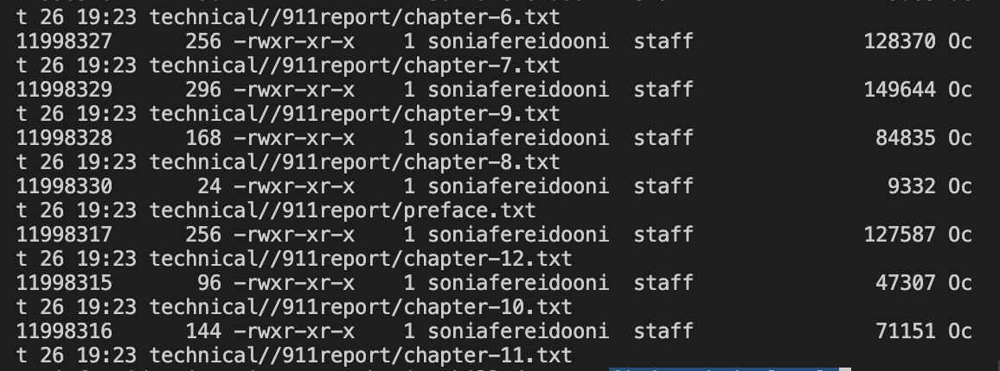
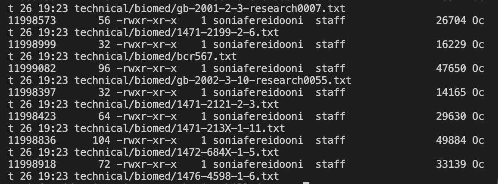
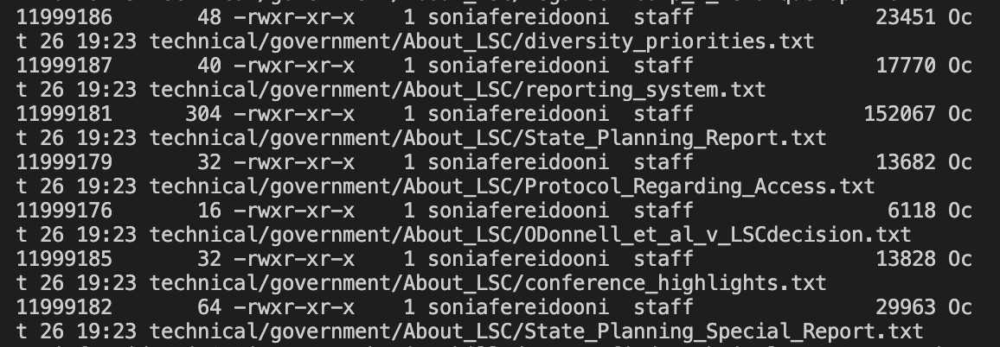

# lab report week 3

## **Introduction**

In this lab we will be exploring the command find, and finding 3 interesting command-line options or other ways to use the find command with examples of using it on files and directories from ./technical. 


## **Original Command: find**


- The find command in terminal is a very powerful tool for searching directories. 
- The find command can be used, as pictured above, to return file names from a specified directory. 
- However, if you want to recieve more specific results from your search, like files

## **Command 1: find -name**

```
# find -name command 1

skill-demo1 % find technical -name "*.txt"
```
Output:


```
# find -name command 2

skill-demo1 % find technical -name "chapter-1.txt"
```
Output:


```
# find -name command 3

find technical -name "biomed"
technical/biomed
```
Output:


- The find -name is used to create a more flexible find command that can be attuned to meet your goal in finding certain files. 
- For example, find -name can be used to find files with a certain name, extention, or name pattern. 

## **Command 2: find -type**

```
# find -type command 1

skill-demo1 % find technical -type *.txt
```
Output:


```
# find -type command 2

skill-demo1 % find technical/biomed -type *.txt
```
Output:


```
# find -type command 3

skill-demo1 % find technical/plos -type *.txt
technical/biomed
```
Output:


- The find -type is used to create a more flexible find command that can be attuned to meet your goal in finding certain files from certain directories of certain types. 
- For example, find -type can be used to find files with a file extension, such as .txt 
- The -type command is quite versatile, and can be used to gather files with matching extensions. 


## **Command 3: find -ls**

```
# find -ls command 1

skill-demo1 % find technical -ls
```
Output:


```
# find -ls command 2

skill-demo1 % find technical/biomed -ls *.txt
```
Output:



```
# find -ls command 3

skill-demo1 % find technical/government/About_LSC -ls
technical/biomed
```
Output:



- The find -ls is used to list out all of the files in the given found directory
- For example, find -ls can be used to find files within a directory, or even a subdirectory if given the correct path
