# lab report week 4

## **Introduction**

In this lab we will be further exploring the use of vim and bash script in the modern world of computing. We will be exploring these uses in the scope of week 6, and viewing their uses in more applications. 


## **Part 1**

**Task from Week 6:** Changing the name of the start parameter and its uses to base

**Series of keys pressed:**
/start\<Enter>cgnbase\<Esc>n.n.n.

**Image of Sequence**

```
# find first instance of "start"
/start<Enter>
```
Output:
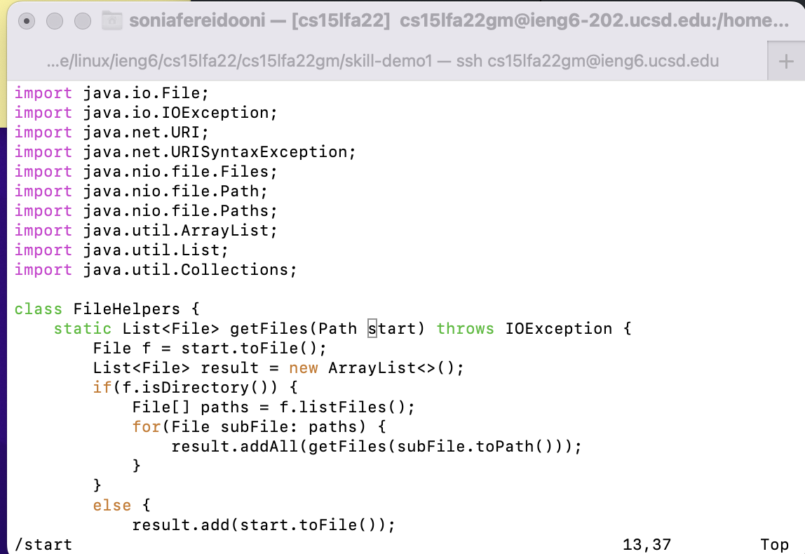

```
# delete start and place cursor at start of word
# enter insert mode
# replace with "base"

cgnbase
```
Output:
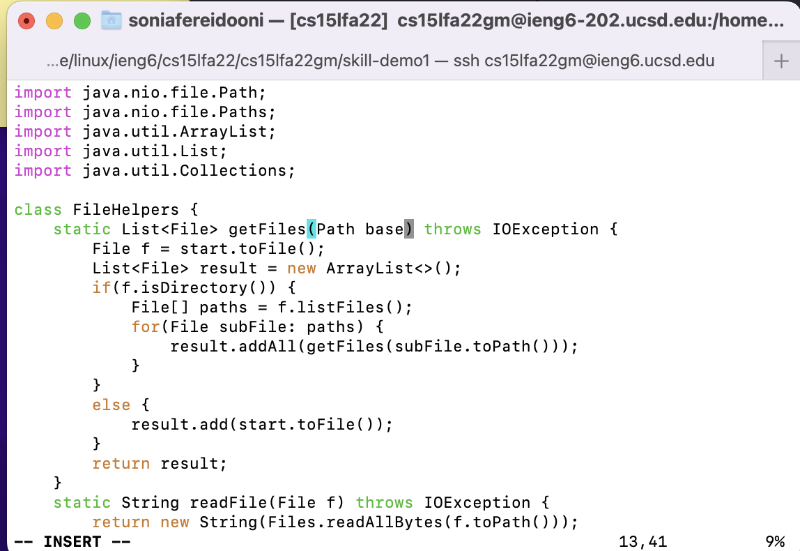

```
# return to normal mode
# find next instance of "start"

<Esc>n
```
Output:
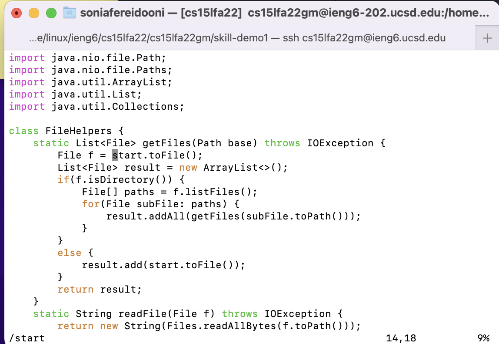

```
# replace with "base"

.
```
Output:
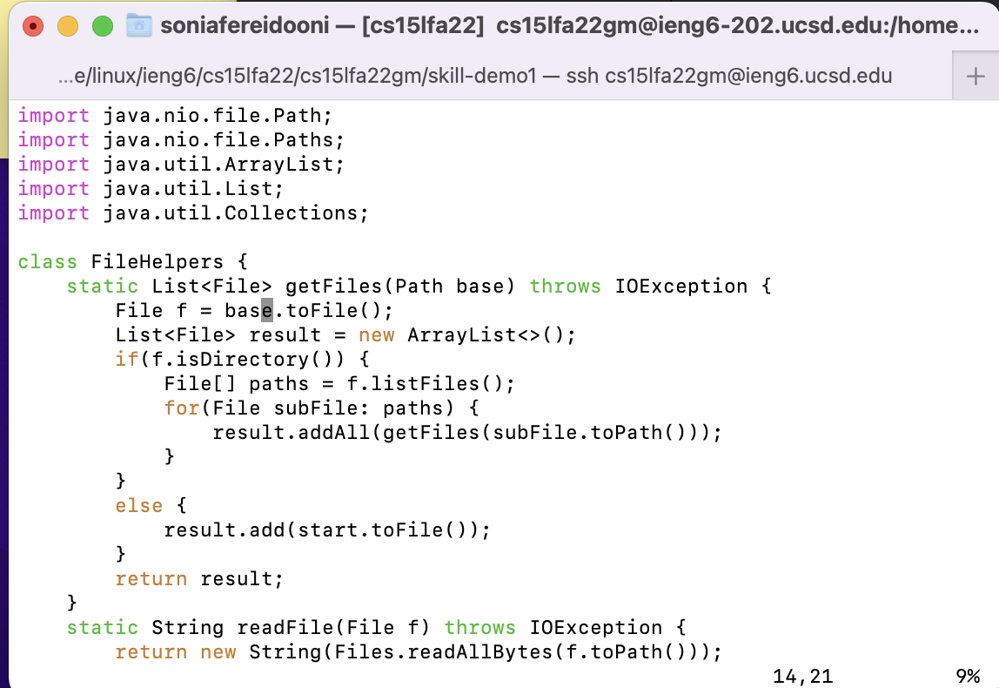

```
# find next instance of "start" 

n.
```
Output:
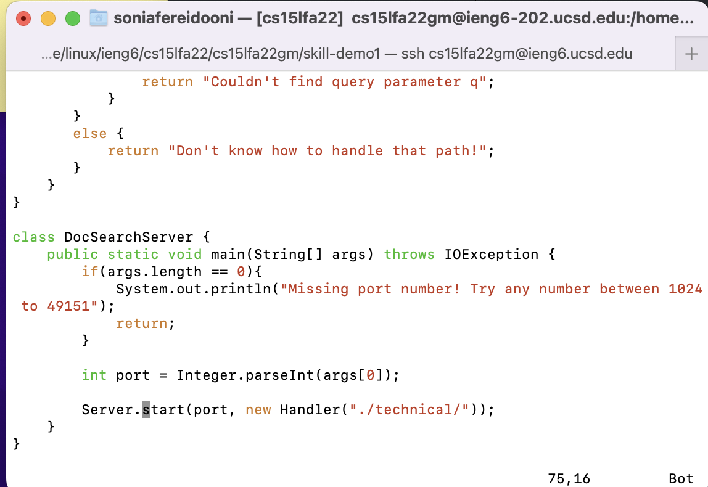


```
# replace with "base"

n.
```
Output:
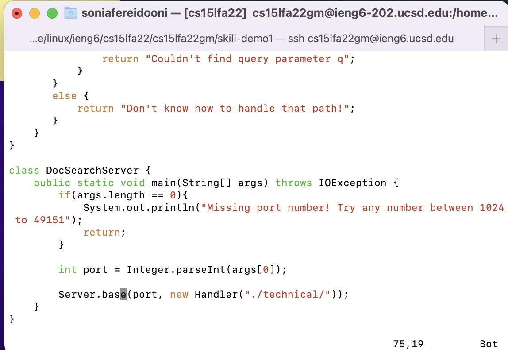

All under 30 keys pressed!


## **Part 2**
Timed Tasks:
- scp version
- vim version

**Completing the task with scp:**

*Time taken:* 4 minutes 30 seconds

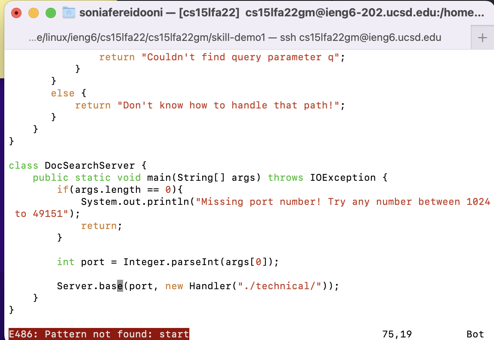

Open the file in VS Code

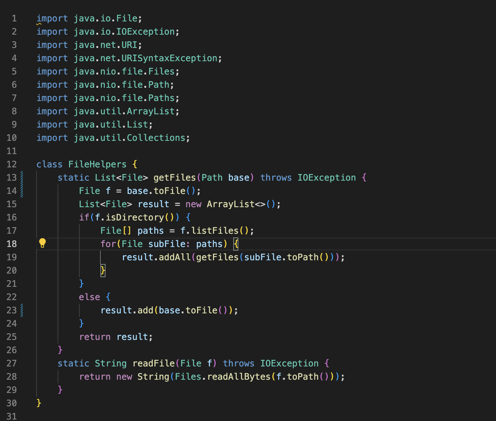

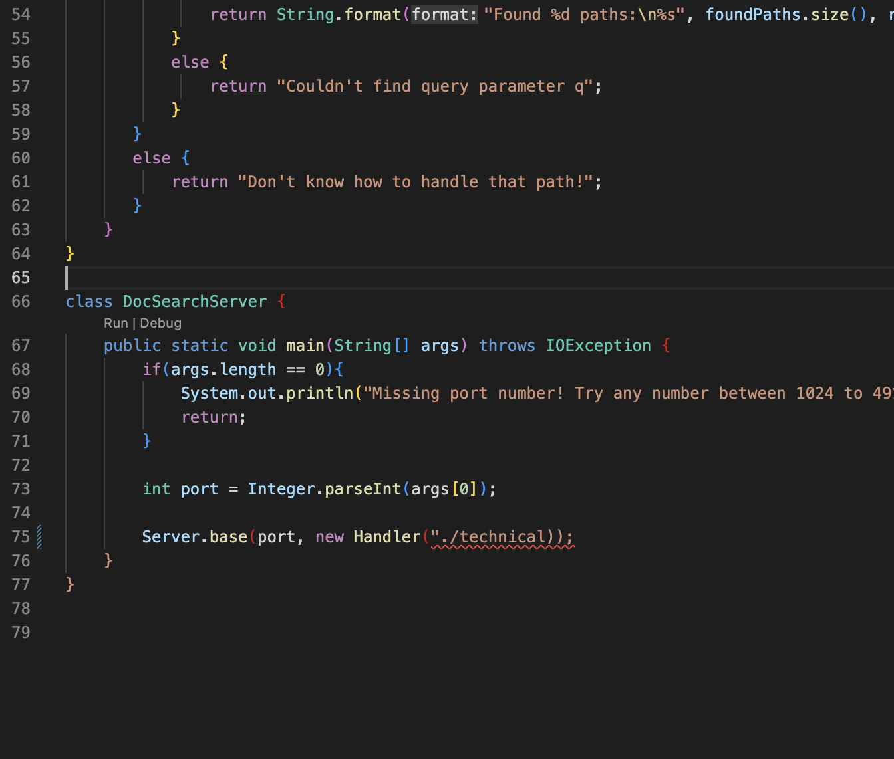

Use ^F to find different instances of "start" and replace with "base".

Save the file and open terminal.

cd into skill-demo1

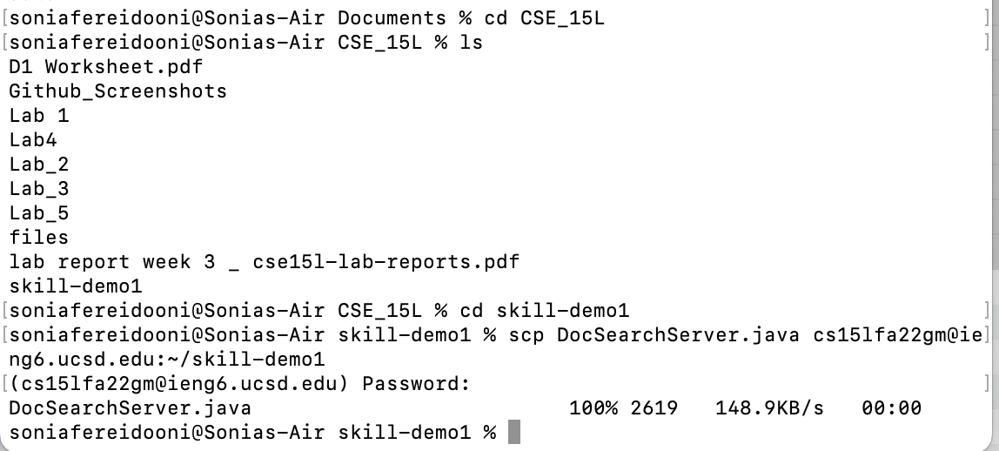

run the base test file

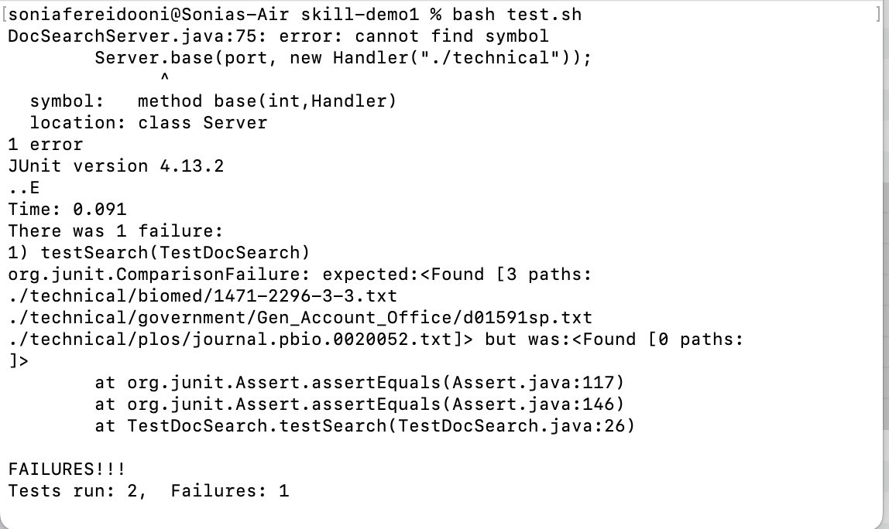

**Completing the task with vim:**

*Time taken:* 1 minute

ssh into server
cd into skill-demo1
open file in vim with "vim DocSearchServer.java"
Make changes to the file with the command:

```
# key presses
/start\<Enter>cgnbase\<Esc>n.n.n.
```


Run the bash script

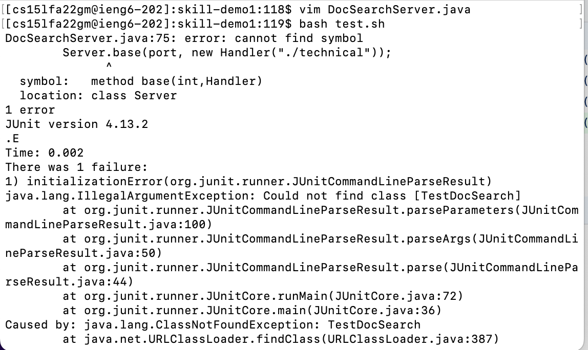

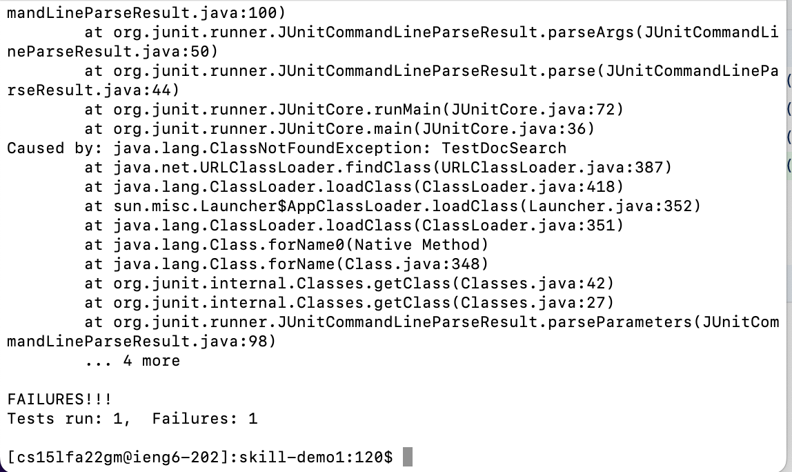

**Questions**
1. **Which of these two styles would you prefer using if you had to work on a program that you were running remotely, and why?
What about the project or task might factor into your decision one way or another? (If nothing would affect your decision, say so and why!)**

    *Personally, I would prefer using vim to work on a remotely run program because with vim you can be already signed into an ssh session and make the edit remotely and proceed to run it remotely. In addition, vim takes less keystrokes to complete the task. Meanwhile, making the edit with scp would require more time spent on manually control F and scp'ing, which would make the task less efficient.*

2. **What about the project or task might factor into your decision one way or another? (If nothing would affect your decision, say so and why!)**

    *If the task deals mostly with making small edits to preexisting code that could be done easily with vim commands, I would probably choose vim. However, if the task involves writing a program from scratch, or writing masses of code, I would probably prefer using an editor like VS Code and scp'ing. This is because vim does not have the best interface for writing code from scratch, and is meant more for making quick edits. Meanwhile, VS Code has a very intuitive interface designed for debugging and writting nicely formatted code.*