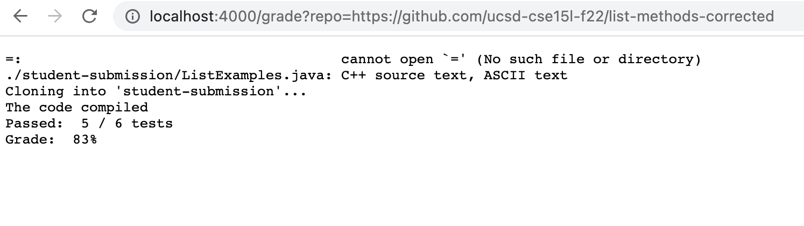
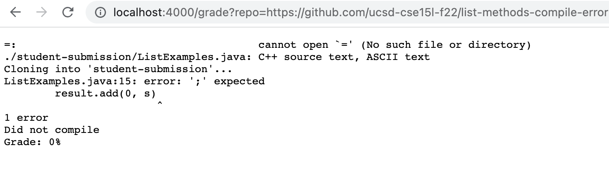
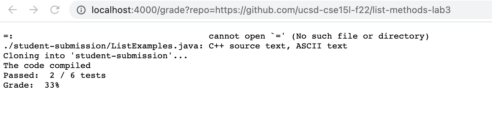

# lab report week 5

## **Introduction**

In this lab we will be further exploring the use of bash scripts to run and grade student submissions. We will attempt to create a good grading script that will give accurate and helpful feedback! 


## **grade.sh code**

**Series of keys pressed:**
/start\<Enter>cgnbase\<Esc>n.n.n.

**Image of Sequence**

```
set -e

FILE = "./student-submission/ListExamples.java"

#clone submission
rm -rf student-submission
git clone $1 student-submission

#check if file exists, then compile and run all tests
if [ -f $FILE ]
then
    #copies test files into directory and enters directory
    cp TestListExamples.java ./student-submission
    cd ./student-submission
    set +e

    #compile
    javac -cp ".:../lib/hamcrest-core-1.3.jar:../lib/junit-4.13.2.jar" *.java

    #checks if compilation failed
    if [ $? -ne 0 ]
    then
        echo "Did not compile"
        echo "Grade: 0%"
        exit 2
    fi

    echo "The code compiled"

    #redirects test runs to output file
    java -cp ".:../lib/hamcrest-core-1.3.jar:../lib/junit-4.13.2.jar" org.junit.runner.JUnitCore TestListExamples > output.txt

    #checks if all the tests passed
    if [ $? -eq 0 ]
    then
        echo "All the tests have passed"
        echo "Grade: 100%"
        exit 0
    fi

    tests=$(grep -i "Tests run" output.txt)
    elements=$(echo $tests | tr " " "\n")
    count=0
    total=""
    pass=""

    #counts the number of tests there are and updates how many have passed
    for i in $elements
    do
        if [ $count == 4 ]
        then
            pass=$i
        fi
        if [ $count == 2 ]
        then
            total=${i%?}
        fi
        count=$((count+1))
    done

    #checks if the passed variable has been updated
    if [ "$pass" != "" ]
    then
        echo "Passed: " "$((total - pass))" / $total "tests"
        echo "Grade: " "$((((total - pass)*100/total*100)/100))"%
    fi
else
    echo "ListExamples.java not found."
    echo "Grade: 0%"
    exit 1
fi

```

## **Student Screenshots**
**student submission repo 1**


**student submission repo 2**


**student submission repo 3**



## **Traced Example**

**Traced example:**
* repo link: https://github.com/ucsd-cse15l-f22/list-methods-compile-error


* Trace:
    1. To preface this trace, the repo used in this example is the  includes a single file "ListExamples.java" that has a syntax error that does not allow the code to compile, resulting in a compile error. 
    2. First, the script clones the repository with the commands below, producing the standard output "Cloning into 'student-submission'..." with an exit code of 0 as it cloned successfully.

    ```
    rm -rf student-submission
    git clone $1 student-submission
    ```
    
    3. Then, the script check if file exists with the if statement below that checks if the file "ListExamples.java" exists, that will equate to true because the file does exist in the student's repo. 

    ```
    if [ -f $FILE ]
    ```

    4. Then, the following commands below are run that copy the local TestListExamples.java file into the student-submission directory to run the tests and evaluate the score. This results in a standard error message of "ListExamples.java:15 error: ';' expected
    result(0,s) 1 error"

    ```
    cp TestListExamples.java ./student-submission
    cd ./student-submission
    set +e
    javac -cp ".:../lib/hamcrest-core-1.3.jar:../lib/junit-4.13.2.jar" *.java
    ```

    5. Finally, the if-statement below runs and outputs "Did not compile Grade:: 0%" with an exit code of 2. The if-statement runs because the code does not compile, and thus the exit code never equals zero. 

    ```
        if [ $? -ne 0 ]
    then
        echo "Did not compile"
        echo "Grade: 0%"
        exit 2
    fi
    ```

    6. Lines that do not run include all the lines after the above if-statement because once the if-statement executed, it resulted in the program exiting. So, none of the tests were viable and were not run since the code did not run in the first place. (lines 28-71 did not run)